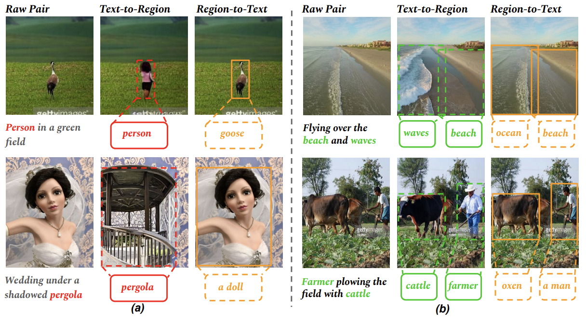
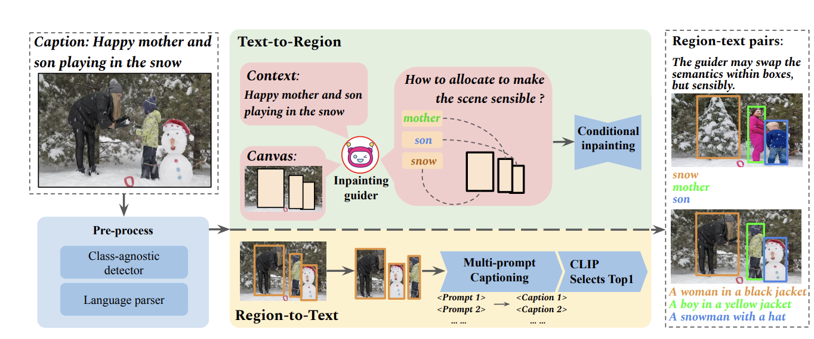
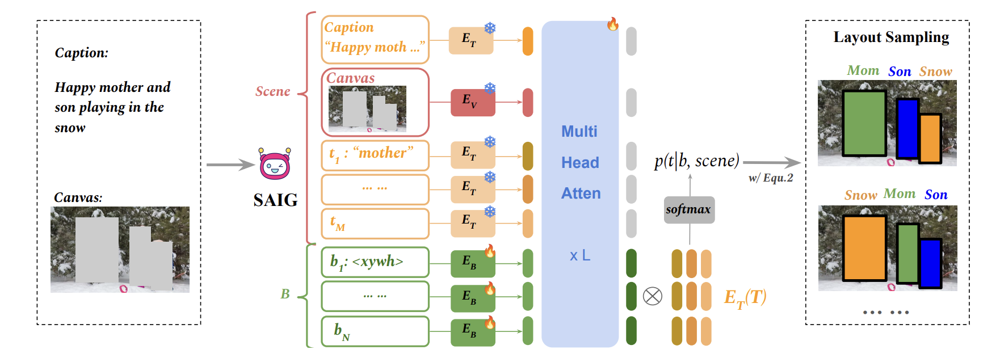

# RTGen: Generating Region-Text Pairs for Open-Vocabulary Object Detection [arxiv](https://arxiv.org/pdf/2405.19854)

> [**RTGen: Generating Region-Text Pairs for Open-Vocabulary Object Detection**](https://arxiv.org/pdf/2405.19854)
> Fangyi Chen*, Han Zhang*, Zhantao Yang, Hao Chen, Kai Hu, Marios Savvides
Carnegie Mellon University


## 📰 News
**2024.6** Generation Pipeline is coming soon.
**2024.6** We released the dataset used in the paper generated by RTGen !
**2024.6** We released the code for training with RTGen !

## 🚀 We generate instance-level data on CC3M, resulting 4.5 M images and 12M region-text pairs.
<div align="center">
  
</div><br/>

Solid modeling of the region semantic relationship could be learned from massive region-text pairs. In this work, we propose RTGen to generate scalable open-vocabulary region-text pairs and demonstrate its capability to boost the performance of open-vocabulary object detection. 

<div align="center">
  
</div><br/>

RTGen includes both text-to-region and region-to-text generation processes on scalable image-caption data. The text-to-region generation is powered by image inpainting, directed by our proposed scene-aware inpainting guider for overall layout harmony.

<div align="center">
  
</div><br/>

For region-to-text generation, we perform multiple region level image captioning with various prompts and select the best matching text according to CLIP similarity.

## 🤔 Localization-aware region-text contrastive learning
We learn object proposals tailored with different localization qualities. 

## 🪓 Installation

We test our models under ```python=3.10, pytorch=1.12.1, cuda=11.3, mmcv=2.1.0```. 

1. Clone this repo
```sh
git clone https://github.com/seermer/RTGen
cd RTGen
```

2. Create a conda env and activate it
```sh
conda create -n rtgen python=3.10
conda activate rtgen
```

3. Install Pytorch and torchvision

Follow the instruction on https://pytorch.org/get-started/locally/.
```sh
# an example:
pip3 install torch torchvision --index-url https://download.pytorch.org/whl/cu118
```

4. Install OpenMMLab Dependencies

Follow the instructions in [INSTALLATION.md](INSTALLATION.md)

## Training
```sh
bash tools/dist_train.sh configs/rtgen/ovcoco/detic_coco_cc3m2.8m_blipregionV2_btsz23232_captwigt1_gen_soft.py 8 --work-dir path/to/coco_r50_train
```

## Inference
```sh
# for ovcoco
bash tools/dist_test.sh configs/rtgen/ovcoco/test_ovcoco_r50.py checkpoints/rtgen_r50_ovcoco.pth 8  --work-dir path/to/coco_r50_test

# for ovlvis R50
bash tools/dist_test.sh configs/rtgen/ovlvis/test_ovlvis_r50.py checkpoints/rtgen_r50_ovlvis.pth 8  --work-dir path/to/lvis_r50_test

# for ovlvis Swin-B
bash tools/dist_test.sh configs/rtgen/ovlvis/test_ovlvis_r50.py checkpoints/rtgen_swinb_ovlvis.pth 8  --work-dir path/to/lvis_swinb_test
```

## 🧪 Main Results

### COCO
| Model | backbone  | supervision | APnovel   | APbase | AP |   model | cfg |
|-----|---------|-------|------|------|------|------|--------|
|Faster-RCNN |R50 | RTGen | 33.6 |   51.7  |   46.9  | [ckpt](https://drive.google.com/file/d/1VJDU8aZ6pZU4VcxCMaWeGWD6paAsqHLl/view?usp=drive_link) |[cfg](configs/xxx.py)|

### LVIS
| Model | backbone  | supervision | APnovel   | APc | APf |  AP |   model | cfg |
|-----|---------|-------|------|------|------|------|--------|------|
|CenterNet |R50 | RTGen | 23.9 |  28.5  |  31.8 |  29.0  | [ckpt](https://drive.google.com/file/d/1AbjFoMLL1ffn6Bqka9NaZeA3nvC0cq-I/view?usp=drive_link) |[cfg](configs/xxx.py)|
|CenterNet |Swin-B| RTGen | 30.2 | 39.9 | 41.3  | 38.8 | [ckpt](https://drive.google.com/file/d/1alJNY8eJy-E7mURJDj5LZFHNZ6SG88CF/view?usp=share_link) | [cfg](configs/xxx.py) |

## ✏️ Citation
If you find this work useful, please use the following entry to cite us:
```
@misc{chen2024rtgen,
      title={RTGen: Generating Region-Text Pairs for Open-Vocabulary Object Detection}, 
      author={Fangyi Chen and Han Zhang and Zhantao Yang and Hao Chen and Kai Hu and Marios Savvides},
      year={2024},
      eprint={2405.19854},
      archivePrefix={arXiv},
      primaryClass={cs.CV}
}
```

